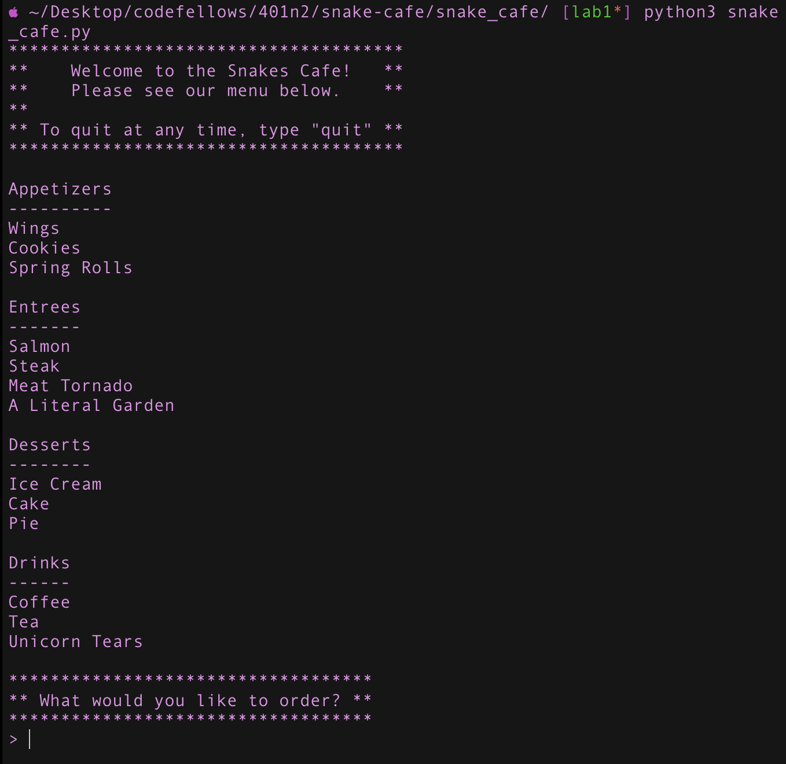
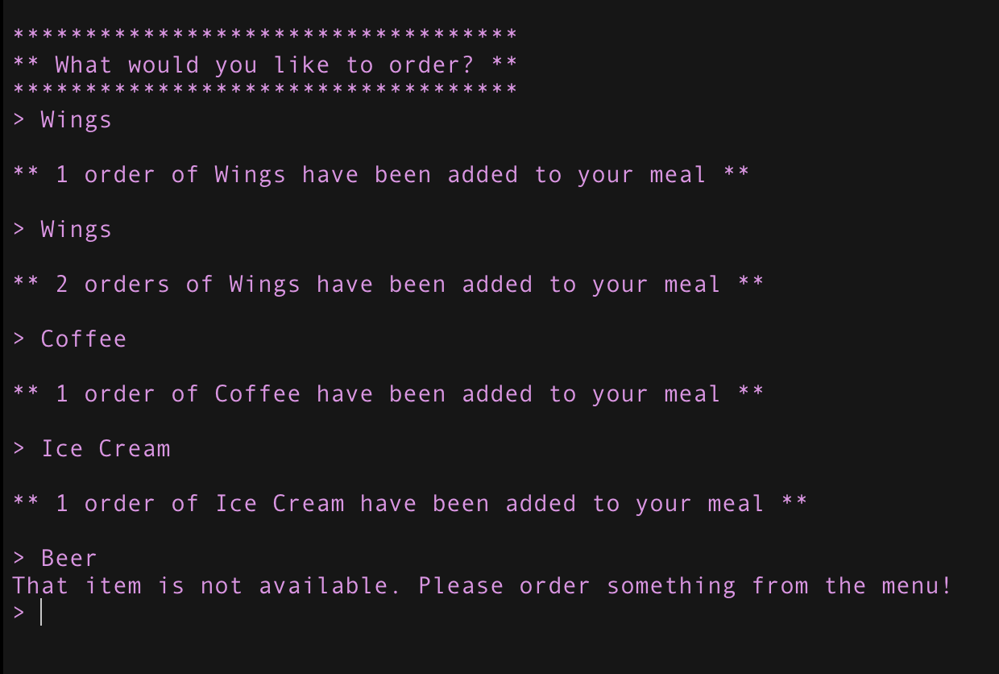

# Snake Cafe README 

## Lab: 01 - Intro to Python
*Author: Grace Choi*
PR link: https://github.com/gracerosemary/snakes-cafe/pull/1
----

## Description
Using basic Python tools, we will use a command line utility that mimics the functionality of a POS system at a restaurant.

---

### Configuration and Getting Started
Use `poetry` to create `snakes-cafe` project.

```
$ poetry new snakes-cafe
```
Create a `snakes_cafe.py` file inside the `snakes_cafe` folder. 
Create a repository on Github with the exact name of `snakes-cafe`.
Clone this repository to your local machine.

```
$ git clone [repo clone url here]
```

### Visuals
#### Application Start
  
#### Using the Application

#### Application End


---

### Change Log
1.1: *Completed all of lab 1* - 5 Dec 2020